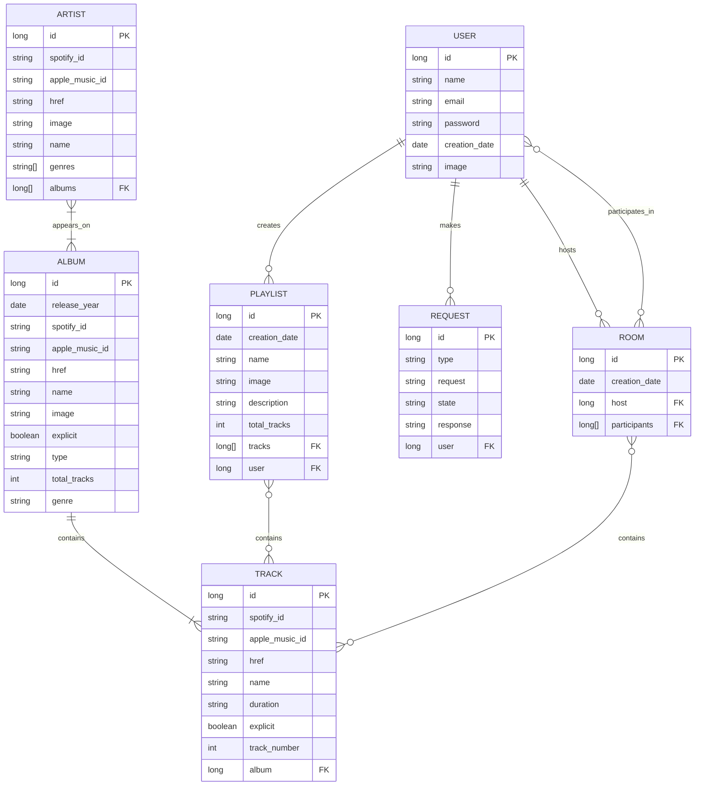

# Music Fever: A Web Application for Streaming Music and Joining Private Collaborative Queues at Gatherings and Parties

# Music Fever: A Web Application for Musical Streaming with Collaborative Reproduction using Joined Queues

# Music Fever: A Web Application for Musical Streaming with a new way of Sharing Music in Collaborative Sessions

## Table of Contents
- [Presentation](#presentation)
- [Objectives](#web-application-objectives)
- [Methodology](#methodology)
- [Detailed Functionality](#detailed-functionality)
- [Analysis](#analysis)
- [Project Tracking](#project-tracking)
- [Author](#author)

## Presentation
> Next: Paragraph summing up the functionality of the web app

> Next: Sketches of the main pages that shows the web functionality

At this point, only the functional and technical objectives of the application have been defined. The implementation of the web application has not been initialized yet.

## Web Application Objectives
This section outlines the different objectives of the application. They are classified into two categories: _functional_ and _technical_ objectives.

### Functional Objectives
> Paragraph summing up the functional objectives and then a list of 2-10 functionalities detailing a bit more the previous paragraph

### Technical Objectives
> Paragraph summing up the technical objectives and then a list of 2-10 technical aspects detailing a bit more the previous paragraph

## Methodology
This section describes how the project will be developed. The development process will be divided into the following phases:

### Getting Started
#### __Phase 1__: functionalities definition
The first phase will defined all the general characteristics of the web application. It will be indicated all the concrete sections that describes the general and detailed functionality of the web.

_Start Date_: 07/07/2026 
_Finish Date_: XX/XX/XXXX

> Gantt Diagram for Phase 1

#### __Phase 2__: project configuration
The second phase will include the configuration of technologies and development tools with quality control that will be exectuded preiodically.

_Start Date_: XX/XX/XXXX 
_Finish Date_: XX/XX/XXXX

> Gantt Diagram for Phase 2

### Iterative and incremental development
#### __Phase 3__: first iteration
The third phase will include the implementation of the basic web functionalities and its quiality control tests.

_Start Date_: XX/XX/XXXX 
_Finish Date_: XX/XX/XXXX

> Gantt Diagram for Phase 3 
> Version published: X.X.X (_release_)

#### __Phase 4__: second iteration
The fourth phase will include the implementation of the intermediate web functionalities and its quiality control tests.

_Start Date_: XX/XX/XXXX 
_Finish Date_: XX/XX/XXXX

> Gantt Diagram for Phase 4 
> Version published: X.X.X (_release_)

#### __Phase 5__: third iteration
The fifth phase will include the implementation of the advance web functionalities and its quiality control tests.

_Start Date_: XX/XX/XXXX 
_Finish Date_: XX/XX/XXXX

> Gantt Diagram for Phase 5 
> Version published: X.X.X (_release_)

### Preparing the presentation
#### __Phase 6__: memory
The sixth phase will be writing the project memory on LaTex.

_Start Date_: XX/XX/XXXX  
_Finish Date_: XX/XX/XXXX

> Gantt Diagram for Phase 6

#### __Phase 7__: presentation
The seventh and last phase will be creating the presentation.

_Start Date_: XX/XX/XXXX 
_Finish Date_: XX/XX/XXXX

> Gantt Diagram for Phase 7

## App's Functionality

This section provides a detailed description of the application's functionalities. Each functionality will be classified according to its level of complexity and the type of user it is intended for.

- The functionalities must be classified as basic, intermediate, or advanced.
- The target user type for each functionality must be clearly defined.
- The functionalities must be grouped according to their level: basic, intermediate, or advanced.

## Analysis
This section describes the main elements that will be analysed before the development of the application. It covers the interface, data model, user roles, multimedia content, data visualisation, supporting technologies, and advanced functionality.

1. **Screens and Navigation:** A mock-up of each screen will be provided, together with a brief description and the pages that can be accessed from it.

### Entities
This section introduces the main entities of the application, which were previously identified in the prototypes. In this context, an __entity__ is an object whose data is stored in the database.

The following list describes the main entities of Music Fever:
- __User__: a registered user who can log in to the application.
- __Artist__: a music artist whose tracks are available in the application.
- __Album__: a music release that contains one or more tracks.
- __Track__: a playable song.
- __Room__: a collaborative session in which users can add tracks to a shared queue.
- __Playlist__: a collection of tracks created by a user to organize their favourite songs.
- __Request__: a request submitted by a user asking the administrators to add an artist, album, or track to the database.

#### Entity Relationships
As the entities have been presented, now it is time to determine which ones are related. The following tables show these relationships for each of the entities and its cardinality.

##### User
| Related with... | Relationship    | Cardinality |
| --------------- | --------------- | ----------- |
| Room            | Hosts           | 0..N        |
| Room            | Participates in | 0..N        |
| Playlist        | Creates         | 0..N        |
| Request         | Makes           | 0..N        |

> [!Note]
> May seem that the _Room_ relation is duplicated but it shows if the user is a host (only one per room) or a participant (multiples per room). This can be seen in the upcoming _Room relationships table_.

##### Artist
| Related with... | Relationship | Cardinality |
| --------------- | ------------ | ----------- |
| Album           | Appears on   | 1..N        |

##### Album
| Related with... | Relationship | Cardinality |
| --------------- | ------------ | ----------- |
| Artist          | Features     | 1..N        |
| Track           | Contains     | 1..N        |

> [!Note]
> One album can be associated with more than one artist as soundtracks albums or collab singles usually have more than one artist àrticipating

##### Track
| Related with... | Relationship   | Cardinality |
| --------------- | -------------- | ----------- |
| Album           | Belongs to     | 1..1        |
| Room            | Is added to    | 0..N        |
| Playlist        | Is included in | 0..N        |

> [!Note]
> Tracks are assumed to belong to only one album, since a track may vary depending on the album in which it appears, such as in explicit and clean versions. Standard and deluxe editions may contain some of the same tracks, but these cases will not be distinguished.

##### Room
| Related with... | Relationship     | Cardinality |
| --------------- | ---------------- | ----------- |
| User            | Has participants | 0..N        |
| User            | Is hosted by     | 1..1        |
| Track           | Contains         | 0..N        |

##### Playlist
| Related with... | Relationship  | Cardinality |
| --------------- | ------------- | ----------- |
| User            | Is created by | 1..1        |
| Track           | Contains      | 0..N        |

##### Request

| Related with... | Relationship | Cardinality |
| --------------- | ------------ | ----------- |
| User            | Is made by   | 1..1        |

The following ER diagram summarizes the information described above and shows the main attributes of each entity.

3. **User Permissions:** The permissions assigned to each type of user will be defined.

4. **Images:** The entities that will have one or more associated images for each item will be identified.

5. **Charts:** The information that will be displayed through charts will be specified, together with the type of chart used, such as line charts, bar charts, or pie charts.

6. **Supporting Technologies:** Any complementary technologies used in the application will be described.

7. **Advanced Algorithm or Search:** The advanced algorithm or search functionality to be implemented will be explained.

## Project Tracking

### Blog
To follow the development of this project, an account on the _Medium_ website will be created to write blog entries on each phase or when the application is updated. To access the blog you can click on the following [link](https://medium.com/@armingarc).

### GitHub Project
The tasks management and planning will be performed through GitHub Projects. A board, similar to the ones used in Kanban projects, has been created with the following columns:
- __Backlog__: items in backlog are ideas for the project that are not ready to be picked up in the moment

- __Ready__: items are ready to be picked up and moved to _In Progress_

- __In Progress__: items that are being worked on at the moment

- __Pending Merge__: completed items in their specific pull request and awaiting tests or merge into main

- __Done__: complete items

The issues (tasks in GitHub) will be sorted onto these columns depending on the state of each one during the project development.

> [!NOTE]
> The issues on _Pending Merge_ actually are the completed sub-issues of the issue (parent) associated with the open pull request.

#### Issue Automatic Status Updates
Issues in GitHub have a number associated with which they can be referenced in commits or pull requests to indicate when should they be closed. This allows issues to be closed automatically without having to use the GitHub interface; however, the changes will not be reflected on the GitHub Projects board.

Using the GitHub API GraphQL (GitHub API v4) the movement of the issues through the board can be automated when an issue is closed. By combining this with GitHub Actions, updates can be triggered when pushing a commit, opening a PR, etc. In this project, three workflows have been created to automate the main issue status transitions.

| Workflow          | Move                  | Description   |
| ----------------- | -----------------     | ------------- |
| issue-to-done     | Close issue to _Done_ | When an issue is closed, it is moved to the Done column. |
| issue-to-pending  | Close sub-issue to _Pending Merge_ | When a commit on a non-default branch references a sub-issue as completed, the sub-issue is moved to Pending Merge.|
| open-issues-status| Open issues to _Ready_/ _In Progress_| When an issue is reopened, it is moved to Ready. When a pull request associated with an issue is opened, the parent issue is moved to In Progress and its open sub-issues are moved to Ready.|

> [!NOTE]
> Some of the movements, as the Ready to In Progress move on sub-issues, have to be done manually because these are movements decided by the developer that do not depend on code or a file from the repository

## Author

This application is being developed as part of the Bachelor's Degree Final Project for the **Computer Science** programme at the Escuela Técnica Superior de Ingeniería Informática (ETSII) of Universidad Rey Juan Carlos (URJC).

The following table identifies the student responsible for the project and the academic supervisor:

| Role       | Name              |
| ---------- | ----------------- |
| Student    | Arminda García Moreno   |
| Supervisor | Iván Chicano Capelo |
