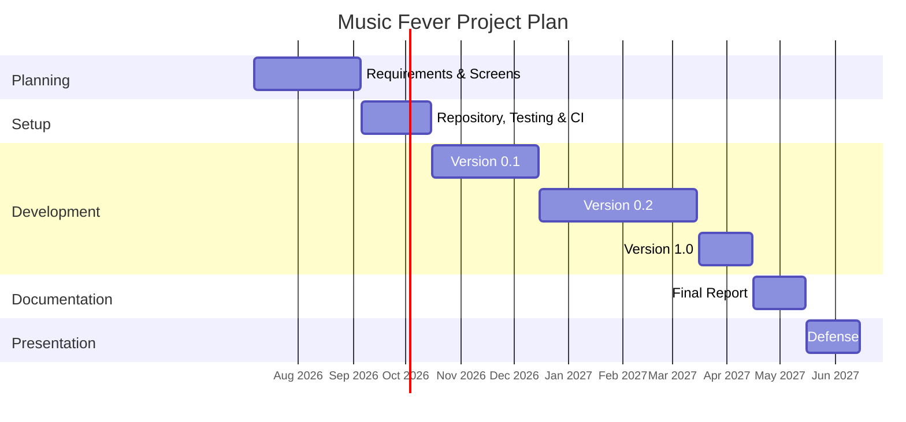
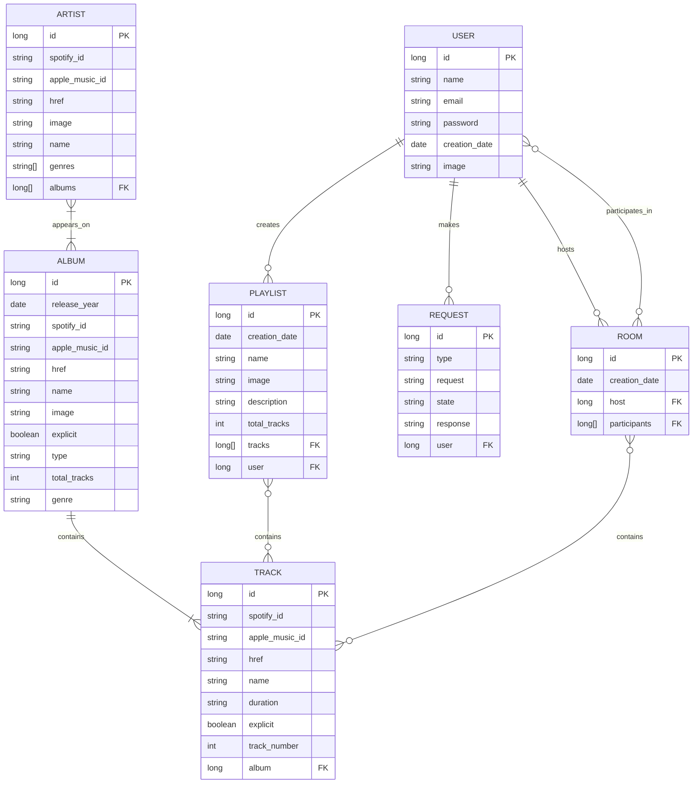

# 🎼 Music Fever: A Web Application for Musical Streaming with a new way of Sharing Music in Collaborative Sessions

## 📑 Table of Contents
- [Presentation](#presentation)
- [Objectives](#web-application-objectives)
- [Methodology](#methodology)
- [Detailed Functionality](#detailed-functionality)
- [Analysis](#analysis)
- [Project Tracking](#project-tracking)
- [Author](#author)

## 👋 Presentation
Music Fever is a music-streaming web application that includes the main features offered by platforms such as Spotify or Apple Music: searching for and listening to your favourite artists, albums, and songs, as well as creating playlists to enjoy them all together. The app’s main new feature is the ability to create rooms where users can listen to music with their friends through a shared and equitable listening queue. The app will also have administrator accounts whose main responsibilities will include answering users’ questions and adding new music to the app’s database. 

At this point, only the functional and technical objectives of the application have been defined. The implementation of the web application has not been initialized yet.

## 🎯 Web Application Objectives
This section outlines the different objectives of the application. They are classified into two categories: _functional_ and _technical_ objectives.

### ⚙️ Functional Objectives
Music Fever aims to be a music management and listening platform that allows users to search for and organize their favorite songs into their own playlists. The main novelty that this application brings compared to its competitors is the possibility of creating collaborative and fair playback queues, where all participants can contribute songs without monopolizing the queue. In addition, Music Fever allows users to view both personal statistics and statistics related to the rooms they have created.

The main functional objectives are:

* **User management:** the application will manage anonymous users, registered users, and administrators, controlling the limitations of each role and the actions they are allowed to perform.
* **Music search:** search for artists, albums, and songs available in the system.
* **Account management:** users will be able to manage their private profile information, log out, and delete their account if they choose to do so.
* **Creation of and participation in rooms:** users will be able to join a room, with only one active room allowed at a time, and they will be able to create one if they meet the required account conditions.
* **Collaborative queue management:** the room will automatically manage the priority of each song added by a user, preventing any single user from monopolizing the queue.
* **Statistics visualization:** the application will collect data and calculate general and personal statistics that will be made available to the user.
* **Request management:** users will be able to send requests to administrators to load songs that are not yet available in the application.
* **Administrator functionalities:** administrators will manage requests and search external APIs directly for data that has not yet been loaded into the system.

### 🛠️ Technical Objectives
From a technical perspective, the objective is to design a maintainable and modular full-stack application capable of connecting to external APIs in order to retrieve the required data and reproduce songs. Collaborative queues will synchronize their state in real time across all connected devices, allowing all participants to know what is currently playing and their estimated position in the queue.

The main technical objectives are:

* **Full-stack implementation:** frontend implemented in Angular and backend implemented in Spring Boot.
* **Real-time communication:** use of WebSockets to synchronize devices within a room in real time.
* **Integration with external APIs:** integration with external APIs, especially Spotify.
* **Authentication and authorization:** implementation of authentication and authorization mechanisms for role management, together with OAuth authentication for connecting Spotify accounts.
* **Data persistence and integrity:** guarantee data persistence and integrity through an application-specific database.
* **Code quality and maintainability:** implementation of unit and E2E tests to verify the correct behavior of the application, together with SonarCloud to continuously monitor code quality.
* **Responsive design:** development of a responsive interface to ensure comfortable use across different devices.
* **Development workflow**: use of GitHub Flow as the development methodology, organizing work through feature branches and pull requests before integrating changes into the main branch.
* **Continuous Integration and Continuous Deployment:** automation of integration and deployment processes through GitHub Actions, with deployment on Railway.

## 🧭 Methodology
This section describes how the project will be developed. The development process will be divided into the following phases:

### 🚀 Getting Started
#### __Phase 1__: functionalities definition
The first phase will defined all the general characteristics of the web application. It will be indicated all the concrete sections that describes the general and detailed functionality of the web.

_Start Date_: 07/07/2026 
_Finish Date_: 31/08/2026

#### __Phase 2__: project configuration
The second phase will include the configuration of technologies and development tools with quality control that will be exectuded preiodically.

_Start Date_: 01/09/2026 
_Finish Date_: 15/10/2026

### 🔁 Iterative and incremental development
#### __Phase 3__: first iteration
The third phase will include the implementation of the basic web functionalities and its quiality control tests.

_Start Date_: 16/10/2026 
_Finish Date_: 15/12/2026

> Version published: 0.1.0

#### __Phase 4__: second iteration
The fourth phase will include the implementation of the intermediate web functionalities and its quiality control tests.

_Start Date_: 16/12/2026 
_Finish Date_: 01/03/2027

> Version published: 0.2.0 

#### __Phase 5__: third iteration
The fifth phase will include the implementation of the advance web functionalities and its quiality control tests.

_Start Date_: 02/03/2027 
_Finish Date_: 15/04/2027

> Version published: 1.0.0

### 🎤 Preparing the presentation
#### __Phase 6__: memory
The sixth phase will be writing the project memory on LaTex.

_Start Date_: 16/04/2027  
_Finish Date_: 15/05/2027

#### __Phase 7__: presentation
The seventh and last phase will be creating the presentation.

_Start Date_: 16/05/2027 
_Finish Date_: 15/06/2027

All this can be visualized in the following _Gantt Diagram_:

## 📱 Application's Functionality
### 🟢 Basic
- Basic search functionality.
- Room implementation:
  - Room creation and joining via code.
  - Song ordering data structure.
  - Song addition and queue management.
- Request system implementation.
- Music download functionality.
- Login and registration system, including user role differentiation.
- Playlist editor implementation.
- Player and queue simulation.

### 🟡 Intermediate
- Statistics logic and processing.
- Responsive application design.
- Light and dark mode.
- WebSocket implementation for real-time room updates across participants.
- Song playback implementation.
- External authentication implementation.

### 🔴 Advanced
- Artist similarity graph.
- Advanced search functionality.
- Automated retrieval and import of newly released albums from Metacritic.

## 📊 Analysis
This section describes the main elements that will be analysed before the development of the application. It covers the interface, data model, user roles, multimedia content, data visualisation, supporting technologies, and advanced functionality.

### 🖥️ Screens & Navigation
The following [document](/docs/pages_and_navigation.md) contains all the mockups designed for the application and shows the navigation flow between them.

### 🗃️ Entities
This section introduces the main entities of the application, which were previously identified in the prototypes. In this context, an __entity__ is an object whose data is stored in the database.

The following list describes the main entities of Music Fever:
- __User__: a registered user who can log in to the application.
- __Artist__: a music artist whose tracks are available in the application.
- __Album__: a music release that contains one or more tracks.
- __Track__: a playable song.
- __Room__: a collaborative session in which users can add tracks to a shared queue.
- __Playlist__: a collection of tracks created by a user to organize their favourite songs.
- __Request__: a request submitted by a user asking the administrators to add an artist, album, or track to the database.

#### Entity Relationships
As the entities have been presented, now it is time to determine which ones are related. The following tables show these relationships for each of the entities and its cardinality.

##### User
| Related with... | Relationship    | Cardinality |
| --------------- | --------------- | ----------- |
| Room            | Hosts           | 0..N        |
| Room            | Participates in | 0..N        |
| Playlist        | Creates         | 0..N        |
| Request         | Makes           | 0..N        |

> [!Note]
> May seem that the _Room_ relation is duplicated but it shows if the user is a host (only one per room) or a participant (multiples per room). This can be seen in the upcoming _Room relationships table_.

##### Artist
| Related with... | Relationship | Cardinality |
| --------------- | ------------ | ----------- |
| Album           | Appears on   | 1..N        |

##### Album
| Related with... | Relationship | Cardinality |
| --------------- | ------------ | ----------- |
| Artist          | Features     | 1..N        |
| Track           | Contains     | 1..N        |

> [!Note]
> One album can be associated with more than one artist as soundtracks albums or collab singles usually have more than one artist àrticipating

##### Track
| Related with... | Relationship   | Cardinality |
| --------------- | -------------- | ----------- |
| Album           | Belongs to     | 1..1        |
| Room            | Is added to    | 0..N        |
| Playlist        | Is included in | 0..N        |

> [!Note]
> Tracks are assumed to belong to only one album, since a track may vary depending on the album in which it appears, such as in explicit and clean versions. Standard and deluxe editions may contain some of the same tracks, but these cases will not be distinguished.

##### Room
| Related with... | Relationship     | Cardinality |
| --------------- | ---------------- | ----------- |
| User            | Has participants | 0..N        |
| User            | Is hosted by     | 1..1        |
| Track           | Contains         | 0..N        |

##### Playlist
| Related with... | Relationship  | Cardinality |
| --------------- | ------------- | ----------- |
| User            | Is created by | 1..1        |
| Track           | Contains      | 0..N        |

##### Request

| Related with... | Relationship | Cardinality |
| --------------- | ------------ | ----------- |
| User            | Is made by   | 1..1        |

The following ER diagram summarizes the information described above and shows the main attributes of each entity.

### 🔐 User Permissions
#### Resource Ownership
The website must be designed so that registered users own specific data or resources. In this way, the owner of a given resource is the only user allowed to modify or delete it.

In MusicFever, registered users can create objects belonging to the following entities:

|Entity |	Allowed Operations |	Notes
|---|---|---|
|Playlist|	Create - Update - Read - Delete (CRUD)	|
|Room|	Create - Read	|
|Request|	Create - Read|	The status of a request is modified by an administrator. Therefore, this is the only exception in which an entity can be modified by a user other than its owner.

In addition, registered users have personal statistics that can only be viewed by them (see the Analytics page). These are read-only data, but they are specific to each user.

> [!Note]
> Anonymous users can submit requests, but these requests are not associated with a registered account. Therefore, anonymous users do not acquire ownership of the requests they create.

#### Allowed Actions by User Role
The following sections list the actions allowed for each type of user within the MusicFever application, as well as the pages they cannot access. In addition, the actions available within a room are described separately depending on the role assumed by the user within that room.

##### Web Application Context
 Action                           | Anonymous | Registered | Registered + Music Account | Admin |
| -------------------------------- | ------- | -------- | ------------------------ | --- |
| Search artists, albums and songs |     ✓     |      ✓     |              ✓             |   ✓   |
| Join a room                      |     ✓     |      ✓     |              ✓             |   ✓   |
| Submit requests                  |     ✓     |      ✓     |              ✓             |   ✓   |
| Manage playlists                 |     —     |      ✓     |              ✓             |   ✓   |
| View personal statistics         |     —     |      ✓     |              ✓             |   —   |
| View submitted requests          |     —     |      ✓     |              ✓             |   ✓   |
| Play songs                       |     —     |      —     |              ✓             |   —   |
| Search and download music from external sites |     —     |      —     |              —             |   ✓   |
| Create rooms                     |     —     |      —     |              ✓             |   —   |
| Manage requests                  |     —     |      —     |              —             |   ✓   |
| View administrative statistics   |     —     |      —     |              —             |   ✓   |
| Login/ Sign in   |     ✓     |      —     |     —      |   —   |
| Logout   |     —    |     ✓     |     ✓      |   ✓  |

##### Room Context
| Action                                   | Participant | Host |
| ---------------------------------------- | :---------: | :--: |
| Search for songs                         |      ✓      |   ✓  |
| Add songs to the queue                   |      ✓      |   ✓  |
| View the playback queue                  |      ✓      |   ✓  |
| Submit song requests                     |      ✓      |   ✓  |
| Leave the room                           |      ✓      |   —  |
| Add songs in host mode (higher priority) |      —      |   ✓  |
| Close the room                           |      —      |   ✓  |

### 📸 Images
One of the requirements of the web application is to support image uploads directly from the web browser. To meet this requirement, users will be able to have a profile picture, which they can upload themselves from their profile page.

Users will also be able to upload cover images for the playlists they create. Both types of images are optional, meaning that choosing not to upload them will not affect the user's experience within the application.

> [!IMPORTANT]
> Artist and album entities have associated images that are retrieved directly from the Spotify API or Apple Music API. These images cannot be replaced by administrator users.

### 📈 Charts
As with images, the application is required to include charts displaying relevant information to users. In this case, general statistics about the application, individual users, and different rooms will be displayed, primarily on the Analytics page.

The amount of information available will depend on the user type. The following sections describe each statistic and the type of chart that will be used to represent it.

#### Anonymous User
Anonymous users will only be able to view general application statistics related to the music listened to by all registered users. These statistics include:

- Most-listened-to music genres in rooms, together with their respective counts, represented using a pie chart.
- Most-listened-to artists in rooms, represented using a bar chart.
- Most-listened-to songs in rooms, represented using a bar chart.
- Comparison of up to three artists based on their number of plays on Music Fever and within rooms, represented using a bar chart.
- Search for similar artists, represented using a graph-based visualization.

#### Registered User
In addition to the statistics available to anonymous users, registered users will have access to more personalized statistics, including:

- Most-listened-to music genre, represented using a pie chart.
- Most-listened-to artist, represented using a bar chart.
- Most-listened-to album, represented using a bar chart.
- Most-listened-to song, represented using a bar chart.
- Number of submitted requests and the percentage corresponding to each request status, represented using a pie chart.
- Hosted rooms compared with joined rooms, represented using a pie chart.

Registered users will also be able to view statistics for each room they have hosted, including:
- Most-listened-to music genre, represented using a pie chart.
- Most-listened-to artist, represented using a bar chart.
- Most active user, represented using a bar chart.

#### Administrator User
Administrator users will be able to view both the general statistics available to anonymous users and more specific application-wide statistics, including:

- Comparison of the times at which rooms are created, represented using a histogram.
- Comparison of the dates on which rooms are created, represented using a histogram.
- Number of submitted requests and the percentage corresponding to each request status, represented using a pie chart.
- Users who have submitted the highest number of requests, represented using a bar chart.
- Users who have created the highest number of rooms, represented using a bar chart.
- Highest room capacity, average capacity, and other related values, represented using statistic cards.
- Evolution of the maximum capacity of created rooms over time, represented using a line chart.
- Evolution of the number of rooms created over time, represented using a line chart.

Administrator users will also be able to view application performance statistics using Grafana. This functionality will be described in greater detail in later development stages.

### 🔧 Complementary Technologies
#### Use of WebSockets
WebSocket technology will be used to update queue status and playback information in real time while users are connected to the same playback queue.

This will allow every user to know which song is currently playing on their device at any given time. This functionality may also be extended to notify users when their next requested song is about to be played.

#### Use of External REST APIs
The public developer APIs provided by Spotify and Apple Music will be used primarily to retrieve the required information about artists, albums, and songs. They will also be used to search for new music from the administrator section.

Additionally, the Spotify API will be used for song playback, with the possibility of extending this functionality to support playback through Apple Music.

### 🧠 Algorithm or Advanced Query
#### Fair Priority Queue
The main innovation of the web application revolves around a new collaborative and fair approach to music playback.

Most current collaborative playback queues are fundamentally based on a FIFO policy, except when users are allowed to manually rearrange the order of songs. This means that one person could add twenty consecutive songs and take over the queue, preventing songs requested by other users from being played. For this reason, the application will implement a fair queue.

The idea works as follows: imagine that Alice adds five songs and Bob subsequently adds only one song. The first song to be played will be Alice's first song, since it was the first song added to the queue. However, the next song will be Bob's song because none of his songs have been played yet, whereas one of Alice's songs has already been played. Therefore, Bob's song has priority over Alice's second song.

A new data structure will be created to manage this process automatically whenever a new song is added to the queue.

#### Advanced Full-Text Search
An advanced full-text search system will be implemented according to the guidelines established in the project specification, as one of the selected optional features.

This functionality will be used to search for artists, albums, and songs from the Search page.

## 📅 Project Tracking

### ✍️ Blog
To follow the development of this project, an account on the _Medium_ website will be created to write blog entries on each phase or when the application is updated. To access the blog you can click on the following [link](https://medium.com/@armingarc).

### 🐙 GitHub Project
The tasks management and planning will be performed through GitHub Projects. A board, similar to the ones used in Kanban projects, has been created with the following columns:
- __Backlog__: items in backlog are ideas for the project that are not ready to be picked up in the moment

- __Ready__: items are ready to be picked up and moved to _In Progress_

- __In Progress__: items that are being worked on at the moment

- __Pending Merge__: completed items in their specific pull request and awaiting tests or merge into main

- __Done__: complete items

The issues (tasks in GitHub) will be sorted onto these columns depending on the state of each one during the project development.

> [!NOTE]
> The issues on _Pending Merge_ actually are the completed sub-issues of the issue (parent) associated with the open pull request.

#### Issue Automatic Status Updates
Issues in GitHub have a number associated with which they can be referenced in commits or pull requests to indicate when should they be closed. This allows issues to be closed automatically without having to use the GitHub interface; however, the changes will not be reflected on the GitHub Projects board.

Using the GitHub API GraphQL (GitHub API v4) the movement of the issues through the board can be automated when an issue is closed. By combining this with GitHub Actions, updates can be triggered when pushing a commit, opening a PR, etc. In this project, three workflows have been created to automate the main issue status transitions.

| Workflow          | Move                  | Description   |
| ----------------- | -----------------     | ------------- |
| issue-to-done     | Close issue to _Done_ | When an issue is closed, it is moved to the Done column. |
| issue-to-pending  | Close sub-issue to _Pending Merge_ | When a commit on a non-default branch references a sub-issue as completed, the sub-issue is moved to Pending Merge.|
| open-issues-status| Open issues to _Ready_/ _In Progress_| When an issue is reopened, it is moved to Ready. When a pull request associated with an issue is opened, the parent issue is moved to In Progress and its open sub-issues are moved to Ready.|

> [!NOTE]
> Some of the movements, as the Ready to In Progress move on sub-issues, have to be done manually because these are movements decided by the developer that do not depend on code or a file from the repository

The board can be viewed via the following [link](https://github.com/orgs/codeurjc-students/projects/50).

## ✒️ Author

This application is being developed as part of the Bachelor's Degree Final Project for the **Computer Science** programme at the Escuela Técnica Superior de Ingeniería Informática (ETSII) of Universidad Rey Juan Carlos (URJC).

The following table identifies the student responsible for the project and the academic supervisor:

| Role       | Name              |
| ---------- | ----------------- |
| Student    | Arminda García Moreno   |
| Supervisor | Iván Chicano Capelo |
