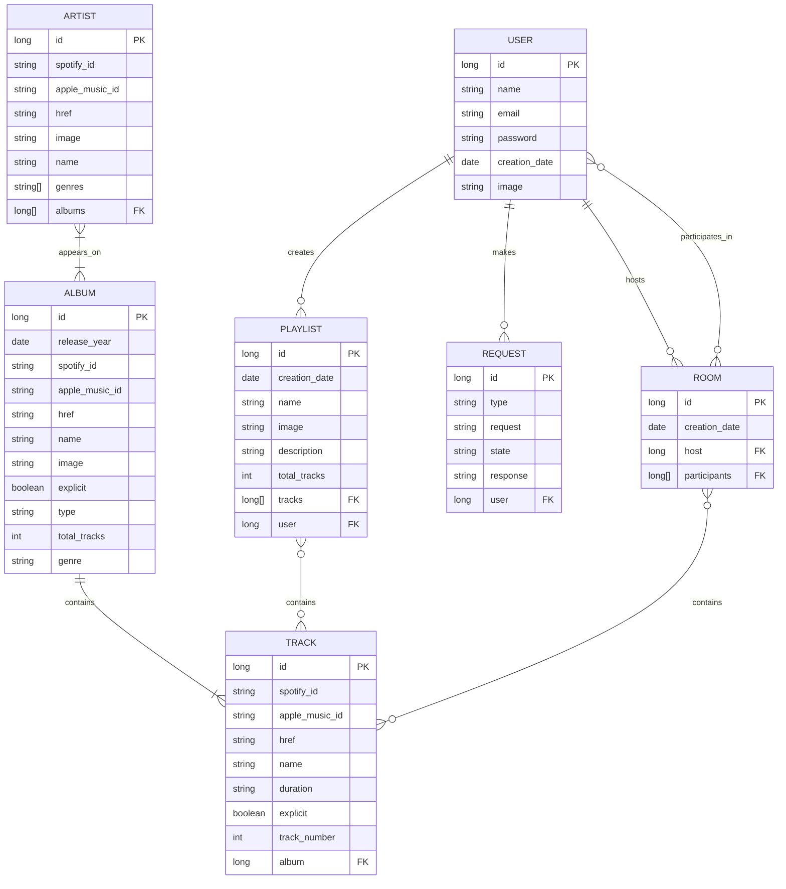

# 📊 Analysis
This section describes the main elements that will be analysed before the development of the application. It covers the interface, data model, user roles, multimedia content, data visualisation, supporting technologies, and advanced functionality.

## 📋 Table of Contents
- [Screens & Navigation](/docs/pages_and_navigation.md)
- [Entities](#️-entities)
- [User Permissions](#-user-permissions)
- [Images](#-images)
- [Charts](#-charts)
- [Complementary Technologies](#-complementary-technologies)
- [Algorithm/ Advance Query](#-algorithm-or-advanced-query)

## 🗃️ Entities
This section introduces the main entities of the application, which were previously identified in the prototypes. In this context, an __entity__ is an object whose data is stored in the database.

The following list describes the main entities of Music Fever:
- __User__: a registered user who can log in to the application.
- __Artist__: a music artist whose tracks are available in the application.
- __Album__: a music release that contains one or more tracks.
- __Track__: a playable song.
- __Room__: a collaborative session in which users can add tracks to a shared queue.
- __Playlist__: a collection of tracks created by a user to organize their favourite songs.
- __Request__: a request submitted by a user asking the administrators to add an artist, album, or track to the database.

### Entity Relationships
As the entities have been presented, now it is time to determine which ones are related. The following tables show these relationships for each of the entities and its cardinality.

#### User
| Related with... | Relationship    | Cardinality |
| --------------- | --------------- | ----------- |
| Room            | Hosts           | 0..N        |
| Room            | Participates in | 0..N        |
| Playlist        | Creates         | 0..N        |
| Request         | Makes           | 0..N        |

> [!Note]
> May seem that the _Room_ relation is duplicated but it shows if the user is a host (only one per room) or a participant (multiples per room). This can be seen in the upcoming _Room relationships table_.

#### Artist
| Related with... | Relationship | Cardinality |
| --------------- | ------------ | ----------- |
| Album           | Appears on   | 1..N        |

#### Album
| Related with... | Relationship | Cardinality |
| --------------- | ------------ | ----------- |
| Artist          | Features     | 1..N        |
| Track           | Contains     | 1..N        |

> [!Note]
> One album can be associated with more than one artist as soundtracks albums or collab singles usually have more than one artist àrticipating

#### Track
| Related with... | Relationship   | Cardinality |
| --------------- | -------------- | ----------- |
| Album           | Belongs to     | 1..1        |
| Room            | Is added to    | 0..N        |
| Playlist        | Is included in | 0..N        |

> [!Note]
> Tracks are assumed to belong to only one album, since a track may vary depending on the album in which it appears, such as in explicit and clean versions. Standard and deluxe editions may contain some of the same tracks, but these cases will not be distinguished.

#### Room
| Related with... | Relationship     | Cardinality |
| --------------- | ---------------- | ----------- |
| User            | Has participants | 0..N        |
| User            | Is hosted by     | 1..1        |
| Track           | Contains         | 0..N        |

#### Playlist
| Related with... | Relationship  | Cardinality |
| --------------- | ------------- | ----------- |
| User            | Is created by | 1..1        |
| Track           | Contains      | 0..N        |

#### Request

| Related with... | Relationship | Cardinality |
| --------------- | ------------ | ----------- |
| User            | Is made by   | 1..1        |

The following ER diagram summarizes the information described above and shows the main attributes of each entity.

## 🔐 User Permissions
### Resource Ownership
The website must be designed so that registered users own specific data or resources. In this way, the owner of a given resource is the only user allowed to modify or delete it.

In MusicFever, registered users can create objects belonging to the following entities:

|Entity |	Allowed Operations |	Notes
|---|---|---|
|Playlist|	Create - Update - Read - Delete (CRUD)	|
|Room|	Create - Read	|
|Request|	Create - Read|	The status of a request is modified by an administrator. Therefore, this is the only exception in which an entity can be modified by a user other than its owner.

In addition, registered users have personal statistics that can only be viewed by them (see the Analytics page). These are read-only data, but they are specific to each user.

> [!Note]
> Anonymous users can submit requests, but these requests are not associated with a registered account. Therefore, anonymous users do not acquire ownership of the requests they create.

### Allowed Actions by User Role
The following sections list the actions allowed for each type of user within the MusicFever application, as well as the pages they cannot access. In addition, the actions available within a room are described separately depending on the role assumed by the user within that room.

#### Web Application Context
 Action                           | Anonymous | Registered | Registered + Music Account | Admin |
| -------------------------------- | ------- | -------- | ------------------------ | --- |
| Search artists, albums and songs |     ✓     |      ✓     |              ✓             |   ✓   |
| Join a room                      |     ✓     |      ✓     |              ✓             |   ✓   |
| Submit requests                  |     ✓     |      ✓     |              ✓             |   ✓   |
| Manage playlists                 |     —     |      ✓     |              ✓             |   ✓   |
| View personal statistics         |     —     |      ✓     |              ✓             |   —   |
| View submitted requests          |     —     |      ✓     |              ✓             |   ✓   |
| Play songs                       |     —     |      —     |              ✓             |   —   |
| Search and download music from external sites |     —     |      —     |              —             |   ✓   |
| Create rooms                     |     —     |      —     |              ✓             |   —   |
| Manage requests                  |     —     |      —     |              —             |   ✓   |
| View administrative statistics   |     —     |      —     |              —             |   ✓   |
| Login/ Sign in   |     ✓     |      —     |     —      |   —   |
| Logout   |     —    |     ✓     |     ✓      |   ✓  |

The permitted actions can also be viewed in the following Use Case Diagram (UCD):

#### Room Context
| Action                                   | Participant | Host |
| ---------------------------------------- | :---------: | :--: |
| Search for songs                         |      ✓      |   ✓  |
| Add songs to the queue                   |      ✓      |   ✓  |
| View the playback queue                  |      ✓      |   ✓  |
| Submit song requests                     |      ✓      |   ✓  |
| Leave the room                           |      ✓      |   —  |
| Add songs in host mode (higher priority) |      —      |   ✓  |
| Close the room                           |      —      |   ✓  |

The permitted actions can also be viewed in the following Use Case Diagram (UCD):

## 📸 Images
One of the requirements of the web application is to support image uploads directly from the web browser. To meet this requirement, users will be able to have a profile picture, which they can upload themselves from their profile page.

Users will also be able to upload cover images for the playlists they create. Both types of images are optional, meaning that choosing not to upload them will not affect the user's experience within the application.

> [!IMPORTANT]
> Artist and album entities have associated images that are retrieved directly from the Spotify API or Apple Music API. These images cannot be replaced by administrator users.

## 📈 Charts
As with images, the application is required to include charts displaying relevant information to users. In this case, general statistics about the application, individual users, and different rooms will be displayed, primarily on the Analytics page.

The amount of information available will depend on the user type. The following sections describe each statistic and the type of chart that will be used to represent it.

### Anonymous User
Anonymous users will only be able to view general application statistics related to the music listened to by all registered users. These statistics include:

- Most-listened-to music genres in rooms, together with their respective counts, represented using a pie chart.
- Most-listened-to artists in rooms, represented using a bar chart.
- Most-listened-to songs in rooms, represented using a bar chart.
- Comparison of up to three artists based on their number of plays on Music Fever and within rooms, represented using a bar chart.
- Search for similar artists, represented using a graph-based visualization.

### Registered User
In addition to the statistics available to anonymous users, registered users will have access to more personalized statistics, including:

- Most-listened-to music genre, represented using a pie chart.
- Most-listened-to artist, represented using a bar chart.
- Most-listened-to album, represented using a bar chart.
- Most-listened-to song, represented using a bar chart.
- Number of submitted requests and the percentage corresponding to each request status, represented using a pie chart.
- Hosted rooms compared with joined rooms, represented using a pie chart.

Registered users will also be able to view statistics for each room they have hosted, including:
- Most-listened-to music genre, represented using a pie chart.
- Most-listened-to artist, represented using a bar chart.
- Most active user, represented using a bar chart.

### Administrator User
Administrator users will be able to view both the general statistics available to anonymous users and more specific application-wide statistics, including:

- Comparison of the times at which rooms are created, represented using a histogram.
- Comparison of the dates on which rooms are created, represented using a histogram.
- Number of submitted requests and the percentage corresponding to each request status, represented using a pie chart.
- Users who have submitted the highest number of requests, represented using a bar chart.
- Users who have created the highest number of rooms, represented using a bar chart.
- Highest room capacity, average capacity, and other related values, represented using statistic cards.
- Evolution of the maximum capacity of created rooms over time, represented using a line chart.
- Evolution of the number of rooms created over time, represented using a line chart.

Administrator users will also be able to view application performance statistics using Grafana. This functionality will be described in greater detail in later development stages.

## 🔧 Complementary Technologies
### Use of WebSockets
WebSocket technology will be used to update queue status and playback information in real time while users are connected to the same playback queue.

This will allow every user to know which song is currently playing on their device at any given time. This functionality may also be extended to notify users when their next requested song is about to be played.

### Use of External REST APIs
The public developer APIs provided by Spotify and Apple Music will be used primarily to retrieve the required information about artists, albums, and songs. They will also be used to search for new music from the administrator section.

Additionally, the Spotify API will be used for song playback, with the possibility of extending this functionality to support playback through Apple Music.

## 🧠 Algorithm or Advanced Query
### Fair Priority Queue
The main innovation of the web application revolves around a new collaborative and fair approach to music playback.

Most current collaborative playback queues are fundamentally based on a FIFO policy, except when users are allowed to manually rearrange the order of songs. This means that one person could add twenty consecutive songs and take over the queue, preventing songs requested by other users from being played. For this reason, the application will implement a fair queue.

The idea works as follows: imagine that Alice adds five songs and Bob subsequently adds only one song. The first song to be played will be Alice's first song, since it was the first song added to the queue. However, the next song will be Bob's song because none of his songs have been played yet, whereas one of Alice's songs has already been played. Therefore, Bob's song has priority over Alice's second song.

A new data structure will be created to manage this process automatically whenever a new song is added to the queue.

### Advanced Full-Text Search
An advanced full-text search system will be implemented according to the guidelines established in the project specification, as one of the selected optional features.

This functionality will be used to search for artists, albums, and songs from the Search page.

[<-- Back to README](../README.md)