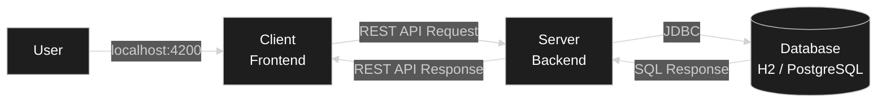
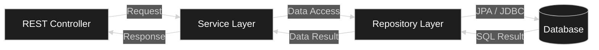
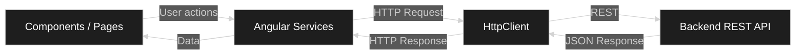
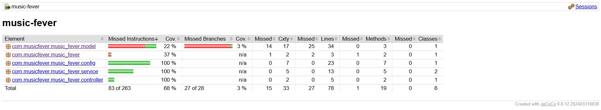
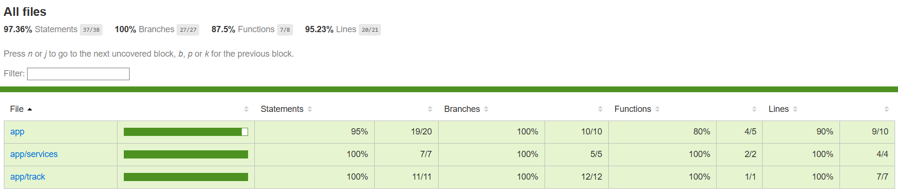
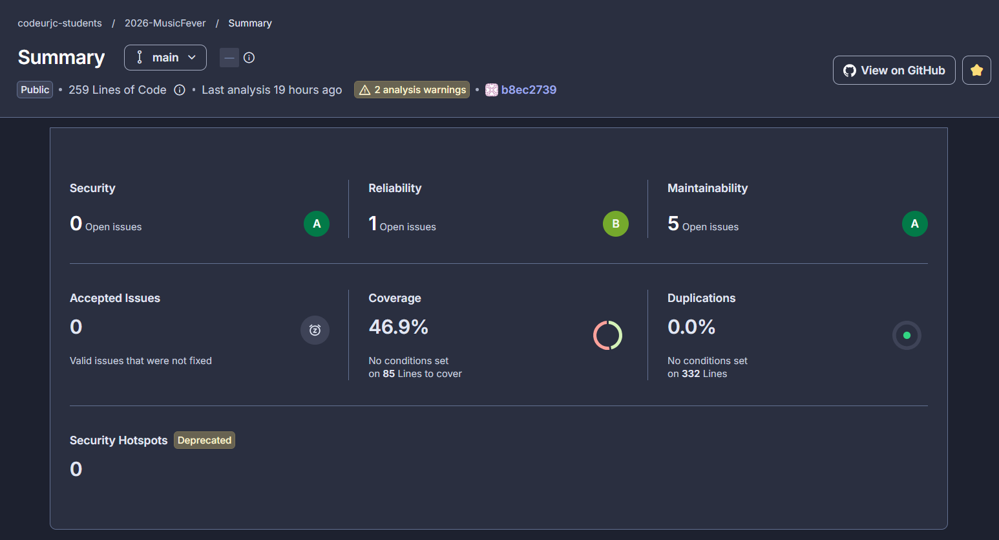
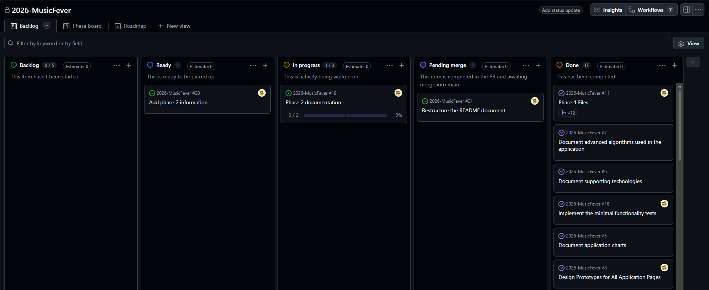
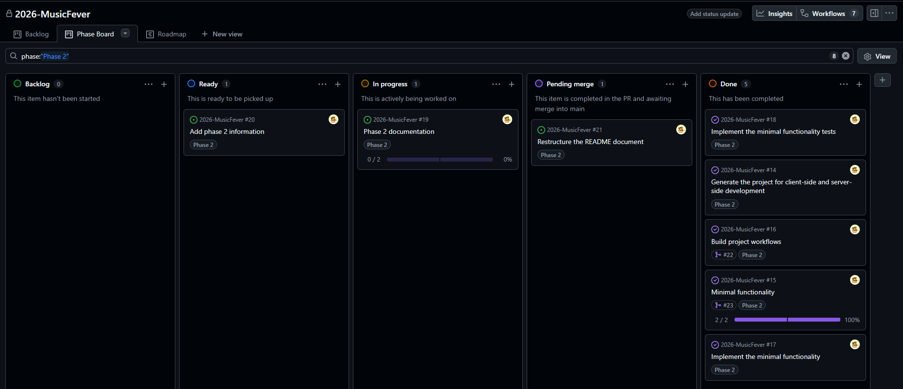
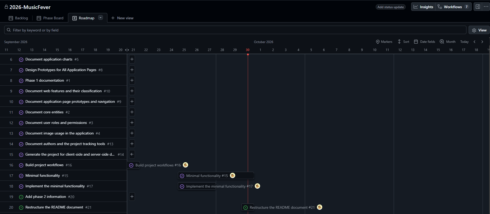

# 🛠️ Development Guide

## 📑 Table of Contents
- [Introduction](#-introduction)
- [Technologies](#-technologies)
- [Tools](#-tools)
- [Architecture](#-architecture)
- [Quality Control](#-quality-control)
- [Development Process](#-development-process)
- [Local Execution](#-local-execution)

## 📘 Introduction
Music Fever is a web application based on a __Single-Page Application (SPA) architecture__. This means that the application loads a single HTML document and, as the user navigates or interacts with it, different parts of the content are dynamically updated in the browser using JavaScript — or TypeScript in this case. Instead of requesting a complete new page from the server for every interaction, the frontend retrieves the required data through API calls and updates the user interface dynamically.

At a high level, the application follows a __client-server architecture__. The frontend is developed as a Single-Page Application (SPA) using Angular, while the backend is implemented as a monolithic Spring Boot application exposing a REST API. The backend manages the business logic and communicates with the __PostgreSQL__ database for data persistence.
- Client (_frontend_): Angular
- Server (_backend_): Spring Boot with a REST API
- Database: PostgreSQL

### 📌 Summary
| Component | Description |
| --- | --- |
| Application Type | Web SPA with REST API |
| Application Architecture | Monolithic |
| Frontend | Angular 22.0.x |
| Backend | Spring Boot 4.1.1 |
| Database | PostgreSQL |
| Programming Languages | Java 21, SQL, TypeScript |
| IDE | Visual Studio Code |
| Auxiliary Tools | REST Client (Visual Studio Code extension), JaCoCo, Git and GitHub |
| Tests | Unit, integration and system (E2E) tests |
| Testing Libraries | JUnit, AssertJ, Mockito, REST Assured, Selenium, Testcontainers, Vitest |
| API Documentation | OpenAPI / Swagger UI |
| Packaging Technology | Docker (TBD)|
| Deployment | Railway (TBD)|
| Development Process | Iterative and incremental process using `git` as the version control system |
| CI/CD | GitHub Actions |

## 💻 Technologies
The application uses the following technologies for its execution:

### ⚙️ Backend
- __Maven__: build automation and dependency management tool. For more information, see the [Official Maven Page](https://maven.apache.org/).
- __Spring Boot__: open-source Java framework designed to create stand-alone, production-grade applications with minimal configuration. For more information, see the [Official Spring Boot Page](https://spring.io/projects/spring-boot).
  - __Spring Web MVC__: used to implement the REST API
  - __Spring Data JPA__: provides access to and management of persistent data
  - __Spring Security__: manages authentication and authorization
- __PostgreSQL__: main relational database management system. For more information, see the [Official PostgreSQL Page](https://www.postgresql.org/).

### 🖼️ Frontend
- __Angular__: open-source web development framework. For more information, see the [Official Angular Page](https://angular.dev/).
- __npm__: package manager used to manage frontend dependencies. For more information, see the [Official npm Page](https://www.npmjs.com/).

### 🚀 Deployment
- __Docker__: containerization technology used to package and run applications in isolated environments. For more information, see the [Official Docker Page](https://www.docker.com/).
- __Railway__: full-stack cloud platform for deploying web applications, servers, databases, and other services, with integrated scaling, monitoring, and security features. For more information, see the [Official Railway Page](https://railway.com/).

## 🔧 Tools
### 🧑‍💻 IDEs
- **Visual Studio Code**: lightweight and extensible source-code editor used for application development, debugging, and integration with development tools and extensions. For more information, see the [Official Visual Studio Code Page](https://code.visualstudio.com/).

### 🧰 Auxiliary Tools
- __Git__: distributed version control system used to track changes in source code and support collaborative development. For more information, see the [Official Git Page](https://git-scm.com/).

- __GitHub__: platform for repository hosting, version control, and software development collaboration. For more information, see the [Official GitHub Page](https://github.com/).
  - __GitHub Actions__: CI/CD automation service used to automatically build, test, and deploy the application. For more information, see the [Official GitHub Actions Page](https://github.com/features/actions).
  - __GitHub Projects__: project management tool used to organize and track tasks, issues, and development progress. For more information, see the [Official GitHub Projects Page](https://github.com/features/issues).

- __JaCoCo__: Java code coverage library used to measure backend test coverage. For more information, see the [Official JaCoCo Page](https://www.jacoco.org/jacoco/).

- __REST Client__: Visual Studio Code extension used to manually send HTTP requests and test REST API endpoints directly from the editor. For more information, see the [REST Client Marketplace Page](https://marketplace.visualstudio.com/items?itemName=humao.rest-client).

- __OpenAPI / Swagger UI__: tools used to define, document, visualize, and interactively explore REST APIs. For more information, see the [Official OpenAPI Page](https://www.openapis.org/) and the [Official Swagger UI Page](https://swagger.io/tools/swagger-ui/).

- __Docker Desktop__: desktop application used to build, run, and manage Docker containers and images in a local development environment. For more information, see the [Official Docker Desktop Page](https://www.docker.com/products/docker-desktop/).
 
## 🏗️ Architecture
The application follows a __client-server architecture__, where the client (frontend) communicates with the server (backend) through a _REST API_.



The backend is built using a __layered monolithic architecture__, following the communication flow shown below:



The frontend also follows a __monolithic architecture__, using services to communicate with the backend API.



### 🚀 Deployment
| Component | Port |
| --- | --- |
| Backend | 8080 |
| Frontend | 4200 |
| Database | ... |

### 🔗 Communication Protocols
The frontend and backend communicate through a __REST API__ over _HTTP_, exchanging data in _JSON_ format.

The backend communicates with the __PostgreSQL__ database through _JDBC_, using the configured persistence layer.

### 🌐 API REST
The backend exposes a `REST API` as communication method with the frontend. This API have been decoumented using `OPEN API (Swagger)` and the documenation can be accessible through this [link](https://raw.githack.com/codeurjc-students/2026-MusicFever/refs/heads/main/docs/api/index.html).

## 🧪 Quality Control

This section describes the quality control measures applied throughout the project.

### ⚙️ Backend Tests

- **__Unit Tests__**: test the business logic implemented in the service layer using mocked database dependencies.
- **__Integration Tests__**: test the integration between the service layer and the database through the repository layer.
- **__E2E Tests__**: test the REST API by verifying that the expected entity data is correctly retrieved.

#### Test Traceability

| Test | Type | Related Functionality |
| --- | --- | --- |
| `TrackServiceTest` | Unit | F00 - Minimal Functionality |
| `TrackIntegrationTest` | Integration | F00 - Minimal Functionality |
| `TrackE2ETest` | E2E | F00 - Minimal Functionality |

#### Test Metrics
| Metric | Value |
| --- | ---: |
| Unit Tests | 1 |
| Integration Tests | 1 |
| E2E Tests | 1 |
| Total Tests | 3 |
| Failed Tests | 0 |
| Skipped Tests | 0 |

`JaCoCo` has been used to analyze the code coverage achieved by the implemented tests:



> [!WARNING]
> As can be seen, at the current stage of the project, test coverage does not yet reach the threshold required to be considered good code coverage. This is mainly due to methods such as `equals()` and `hashCode()` implemented in the application entities, which are not directly tested.

To be able to generate the JaCoCo report, its plugin should be on the `pom.xml` file:
```xml
<plugin>
    <groupId>org.jacoco</groupId>
    <artifactId>jacoco-maven-plugin</artifactId>
    <version>0.8.12</version>
    <executions>
        <execution>
            <goals>
                <goal>prepare-agent</goal>
            </goals>
        </execution>

        <execution>
            <id>report</id>
            <phase>verify</phase>
            <goals>
                <goal>report</goal>
            </goals>
        </execution>
    </executions>
</plugin>
```

> [!NOTE]
> The generation of the `JaCoCo` report is explained in the [local executions](#test-execution) section.

### 🖼️ Frontend Tests

- **__Unit Tests__**: test component functionality using mocked services or stores and a virtual DOM.
- **__Integration Tests__**: test the integration between frontend components and the real REST API.
- **__E2E Tests__**: test the user interface by verifying that the expected data is correctly displayed on the main page.

#### Test Traceability

| Test | Type | Related Functionality |
| --- | --- | --- |
| `tracklist.spec.ts` | Unit | F00 - Minimal Functionality |
| `track.integration.spec.ts` | Integration | F00 - Minimal Functionality |
| `TrackSystemTest` | System | F00 - Minimal Functionality |

#### Test Metrics
| Metric | Value |
| --- | ---: |
| Unit Tests | 1 |
| Integration Tests | 1 |
| E2E Tests | 1 |
| Total Tests | 3 |
| Failed Tests | 0 |
| Skipped Tests | 0 |

`Vitest` has been used to analyze the code coverage achieved by the implemented tests:



> [!NOTE]
> The generation of the `Vitest` report is explained in the [local executions](#test-execution) section.

### 🔍 Static Code Analysis

In addition to test coverage analysis, the project has been integrated with **SonarCloud** to continuously monitor its code quality.

#### Code Size Metrics

The following metrics summarize the size of the current implementation:

| Metric | Value |
| --- | ---: |
| Total Lines of Code | 259 |
| Java | 182 |
| TypeScript | 64 |
| HTML | 13 |
| Clases | 10 |

These metrics correspond to the current development stage, which only includes the synchronization module of Music Fever.


## 🔄 Development Process
This section describes the main technical aspects of the project’s development process.

### 🪜 Iterative and Incremental Process
The project follows an __iterative and incremental development process__, organized into different phases according to the main objectives of the application. Each phase introduces a new set of functionalities that are progressively implemented, tested, and integrated into the existing system. The process is guided by Agile principles and incorporates selected practices from _Extreme Programming (XP)_ and _Kanban_, particularly continuous testing, incremental delivery, and visual task management.

### 📋 Issue Managment
The tasks management and planning will be performed through __GitHub Projects__. A board, similar to the ones used in _Kanban_ projects, has been created with the following columns:
- __Backlog__: items in backlog are ideas for the project that are not ready to be picked up in the moment

- __Ready__: items are ready to be picked up and moved to _In Progress_

- __In Progress__: items that are being worked on at the moment

- __Pending Merge__: completed items in their specific pull request and awaiting tests or merge into main

- __Done__: complete items

The issues (tasks in GitHub) will be sorted onto these columns depending on the state of each one during the project development.



> [!NOTE]
> The issues on _Pending Merge_ actually are the completed sub-issues of the issue (parent) associated with the open pull request.

#### Views
In addition, this board includes two other views: __Phase Board__ and __Roadmap__.

A property called _phase_ has been added to all project issues to indicate which phase each task belongs to. Therefore, the __Phase Board__ view displays only the issues associated with the selected phase, usually the phase the project is currently in, so that issues from other phases do not clutter the board.



On the other hand, the __Roadmap__ view provides a timeline showing when issues were started and completed, as well as which issues are currently in progress.



#### Issue Automatic Status Updates
Issues in GitHub have a number associated with which they can be referenced in commits or pull requests to indicate when should they be closed. This allows issues to be closed automatically without having to use the GitHub interface; however, the changes will not be reflected on the GitHub Projects board.

Using the GitHub API GraphQL (GitHub API v4) the movement of the issues through the board can be automated when an issue is closed. By combining this with GitHub Actions, updates can be triggered when pushing a commit, opening a PR, etc. In this project, three workflows have been created to automate the main issue status transitions.

| Workflow          | Move                  | Description   |
| ----------------- | -----------------     | ------------- |
| issue-to-done     | Close issue to _Done_ | When an issue is closed, it is moved to the Done column. |
| issue-to-pending  | Close sub-issue to _Pending Merge_ | When a commit on a non-default branch references a sub-issue as completed, the sub-issue is moved to Pending Merge.|
| open-issues-status| Open issues to _Ready_/ _In Progress_| When an issue is reopened, it is moved to Ready. When a pull request associated with an issue is opened, the parent issue is moved to In Progress and its open sub-issues are moved to Ready.|

> [!NOTE]
> Some of the movements, as the Ready to In Progress move on sub-issues, have to be done manually because these are movements decided by the developer that do not depend on code or a file from the repository.

### 🌿 Git
The project has been managed using a __Git__ repository hosted on __GitHub__, which has been used to track changes in the source code and coordinate the development process.

The branching strategy followed throughout the project is __GitHub Flow__. This approach keeps the main branch as the stable version of the application, while new features, fixes, and other changes are developed in separate branches. Once the work on a branch is completed and reviewed (using _pull request_), it is merged back into main. 

In this case, three types of branches are used:
- `feature/`: used to implement new features in the application.
- `fix/`: used to fix bugs or make minor improvements to the code.
- `docs/`: used to add or significantly update the project documentation.
- `ci/`: used to add or modify the workflows of the project.
- `config/`: used to add configuration of the repository or the web.

This strategy provides a simple and structured workflow, while keeping the development history clear and making it easier to isolate changes and review them before integration.

The following metrics correspond to the state of the repository at the time of submission.
| Metric | Value |
| --- | ---: |
| Total commits | 81 |
| Active Branches | 2 |
| Merged pull requests | 5 |

### ⚙️ Continuous Integration
Continuous Integration is implemented using __GitHub Actions__, which automatically executes quality checks whenever relevant changes are pushed or proposed for integration into `main`.

The workflows that govern the development and quality control processes of this project are described below:

| Workflow | Tasks |
| --- | --- |
| `basic-quality` | Runs on every push to feature branches. It builds both the backend and frontend, executes their unit tests, and performs static code analysis using SonarCloud. |
| `full-quality` | Runs on pull requests targeting `main`. It executes unit, integration, and system (E2E) tests for both the backend and frontend, generates code coverage reports, and sends the analysis results to SonarCloud. This workflow can be configured as a required quality check so that the pull request cannot be merged if any validation fails. |
| `sonar-main-analysis` | Runs whenever a commit is pushed to `main` and synchronizes the latest code quality analysis with SonarCloud. Under the adopted GitHub Flow strategy, commits to `main` should normally result from merged pull requests. |

## ▶️ Local Execution
The following steps describe how to run the application locally from the source code available in the repository.

### 📦 Requirements
Before running the application locally, make sure the following tools are installed:

| Tool | Version | Purpose |
|---|---:|---|
| Java | 21 | Required to run the Spring Boot backend. |
| Maven | 3.9+ | Used to manage backend dependencies and run the Spring Boot application. |
| Node.js | 22+ | Required to run the Angular frontend. |
| npm | 12.0.1 | Used to install and manage frontend dependencies. |
| Angular CLI | 22.0.8 | Used to run and manage the Angular application. |
| PostgreSQL | 16+ | Main relational database used by the application. |
| Docker Desktop | Latest stable | Required when running Docker-based services or integration tests locally. |

### 📥 Clone the Repository
Clone the repository to your local machine:
```bash
git clone https://github.com/codeurjc-students/2026-MusicFever.git
```

Then, move into the project directory:
```bash
cd 2026-MusicFever
```

### ⚡ Run the Application
First, start the backend application. Navigate to the backend directory:
```bash
cd ./backend/music-fever
```

Then, start the Spring Boot application using Maven:
```bash
mvn spring-boot:run
```

Once started, the backend will be available locally at: [http://localhost:8080](http://localhost:8080)

To run the frontend, open a new terminal and navigate to the frontend directory:
```bash
cd ./frontend
```

Install the dependencies:
```bash
npm install
```

Then, start the Angular development server:
```bash
ng serve
```

The web application will then be available locally at: [http://localhost:4200](http://localhost:4200)

### 🌐 Interacting with the REST API
The REST API can be tested using the **REST Client** extension for Visual Studio Code.

To use this tool, the extension must first be installed in the IDE. Once installed, API requests can be defined in a `.http` file inside the project. This file contains the HTTP requests that will be sent to the server, including the required method (`GET`, `POST`, `PUT`, `DELETE`, etc.), endpoint, headers, and request body when necessary. Each request can be executed directly from Visual Studio Code by clicking the __Send Request__ option provided by the extension. The response returned by the backend is displayed inside the IDE, allowing the API endpoints to be tested without using an external application.

An example file containing sample requests for some of the available REST API operations can be found in the following link: [REST API examples](../backend/music-fever/src/request/trackRequests.http)

> _Note_: Other tools such as __Postman__ can also be used to interact with the REST API. In that case, the required configurations (base URL, headers, authentication, request body, etc.) must be adapted according to the selected tool.

### 🧪 Test Execution

The project includes automated tests for both the backend and frontend applications.

#### Backend Tests
Backend tests are implemented using the Spring Boot testing framework, JUnit, Mockito, and REST Assured.

To execute the backend tests, navigate to the backend directory:
```bash
cd ./backend/music-fever
```

Then, run:
```bash
mvn test
```

This command compiles the project and executes all backend test cases.

#### Backend Test Coverage
Code coverage reports are generated using **JaCoCo**. To execute the tests and generate the coverage report, run:
```bash
mvn clean verify
```

After execution, the generated HTML coverage report can be found at:
```text
target/site/jacoco/index.html
```

Opening this file in a browser provides detailed information about the covered classes, methods, and lines of code.

#### Frontend Tests
Frontend tests are implemented using Angular testing utilities and Vitest.

To execute the frontend tests, navigate to the frontend directory:
```bash
cd ./frontend
```

Then, install the required dependencies (if not install on previous steps)
```bash
npm install
```

Run the frontend tests using:
```bash
npm test
```

or alternatively:
```bash
ng test
```

#### Frontend Test Coverage
To generate the frontend test coverage report, run:
```bash
npm run test:coverage
```

The coverage report will be generated in the following directory:
```text
coverage/
```

The HTML coverage report can be opened at:
```text
coverage/index.html
```
Coverage reports are generated locally and are not committed to the repository.

### 🏷️ Make a Release
Project releases are managed through the GitHub Releases system. To create a new release:
1. Navigate to the __Releases__ section of the GitHub repository.
2. Select __Create a new release__.
3. Create a new version tag following semantic versioning principles (for example, `v1.0.0`).
4. Add a title and a description summarizing the changes included in the release.
5. Publish the release.

Each release is associated with a specific Git commit, allowing the source code version corresponding to a delivered version of the application to be identified.

[<-- Back to README](../README.md)