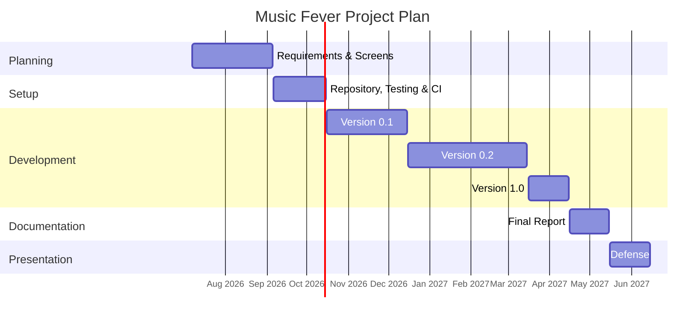

# 🧭 Methodology
The development methodology will follow an **incremental and iterative approach**, allowing new functionalities to be incorporated progressively and continuous adjustments to be made throughout the project. **GitHub Flow** will be used to manage the source code and development workflow, relying on feature branches and *pull requests* before integrating changes into the main branch. In addition, **GitHub Actions** will be used to implement **continuous integration and continuous deployment (CI/CD)** processes, automating tasks such as testing, code validation, and, when appropriate, the deployment of new application versions.

The development process will be divided into the following phases:

## 🚀 Getting Started
### __Phase 1__: functionalities definition
The first phase will defined all the general characteristics of the web application. It will be indicated all the concrete sections that describes the general and detailed functionality of the web.

| Date | Value |
|---|---|
| **Start Date** | 07/07/2026 |
| **Estimated Finish Date** | 05/09/2026 |
| **Real Finish Date** | 09/09/2026 |

### __Phase 2__: project configuration
The second phase will include the configuration of technologies and development tools with quality control that will be exectuded preiodically.

| Date | Value |
|---|---|
| **Start Date** | 09/07/2026 |
| **Estimated Finish Date** | 15/10/2026 |
| **Real Finish Date** | ... |

## 🔁 Iterative and incremental development
### __Phase 3__: first iteration
The third phase will include the implementation of the basic web functionalities and its quiality control tests.

| Date | Value |
|---|---|
| **Start Date** | 16/10/2026 |
| **Estimated Finish Date** | 15/12/2026 |
| **Real Finish Date** | ... |

> Version published: 0.1.0

### __Phase 4__: second iteration
The fourth phase will include the implementation of the intermediate web functionalities and its quiality control tests.

| Date | Value |
|---|---|
| **Start Date** | 16/12/2026 |
| **Estimated Finish Date** | 01/03/2027 |
| **Real Finish Date** | ... |

> Version published: 0.2.0 

### __Phase 5__: third iteration
The fifth phase will include the implementation of the advance web functionalities and its quiality control tests.

| Date | Value |
|---|---|
| **Start Date** | 02/03/2027 |
| **Estimated Finish Date** | 15/04/2027 |
| **Real Finish Date** | ... |

> Version published: 1.0.0

## 🎤 Preparing the presentation
### __Phase 6__: memory
The sixth phase will be writing the project memory on LaTex.

| Date | Value |
|---|---|
| **Start Date** | 16/04/2027 |
| **Estimated Finish Date** | 15/05/2027 |
| **Real Finish Date** | ... |

### __Phase 7__: presentation
The seventh and last phase will be creating the presentation.

| Date | Value |
|---|---|
| **Start Date** | 16/05/2027 |
| **Estimated Finish Date** | 15/06/2027 |
| **Real Finish Date** | ... |

All this can be visualized in the following _Gantt Diagram_:

[<-- Back to README](../README.md)